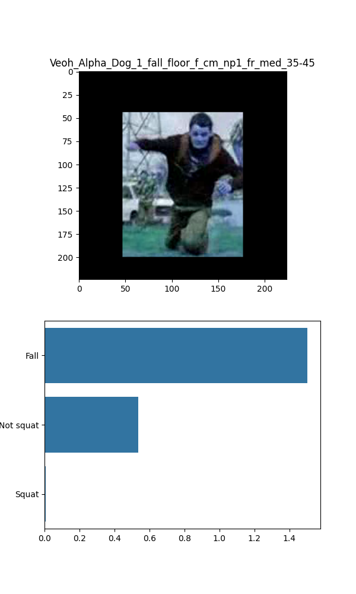

# fall-detection-pytorch
A pytorch implementation of fall/squat/others detection.

[Code reference](https://github.com/TerenceChen95/pneumonia-detection-pytorch)
## DataSet
- Fall(3000)
  - UR-fall
  - Multiple cameras fall dataset
  - HMDB51/fall_floor

- Others(3000)
  - UCF101/WalkingWithDog
  - UTD-MHAD/Walk(in place)
  - UTD-MHAD/Pickup and throw
  - UTD-MHAD/Stand to sit
  - UTD-MHAD/Lunge(left foot forward)

- Squat(3000)
  - UTD-MHAD/Squat(teo arms stretch out)
  - Image dataset shooting by myself

## Main Idea
- 3-class classification
  - Fall
  - Squat
  - Others
- Trian with resnet50/densenet121/vgg16
  - Fine-tuning classifier
  - Resnet performs better than densenet
- Detecte from video frames(Test)
  - Save 1 frame from 3

## Run
For testing the model, run <demo.py>

For training the model, run <main.py>

A dataset(All images in one file) is needed:
- FALL-DETECTION
  - dataset/
  - train.txt(for dataset label)
  - main.py

## Requirments
 - Torch
 - Matplotlib
 - CUDA = 11.0
 - Numpy
 - Pandas
 - OpenCV
 - Seaborn
 - Pillow

  

